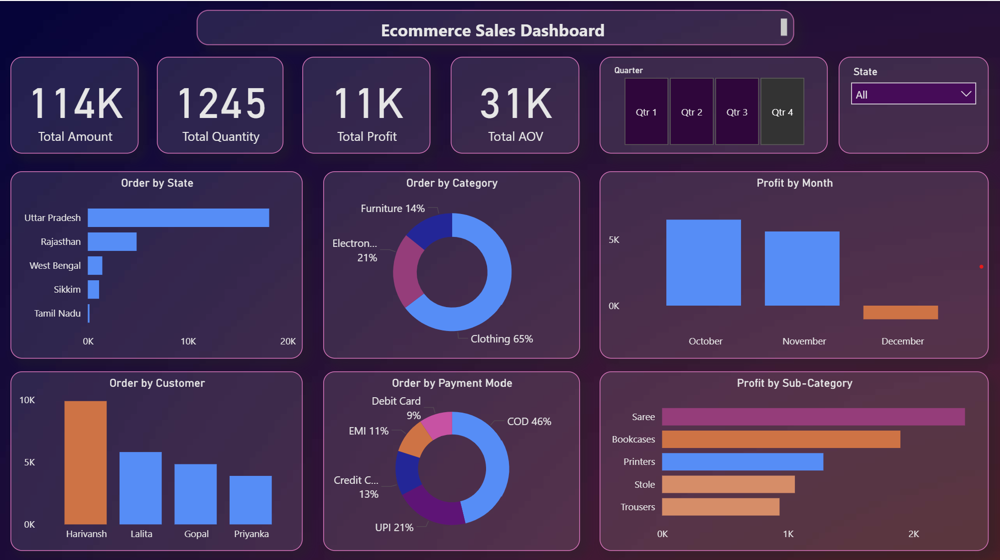
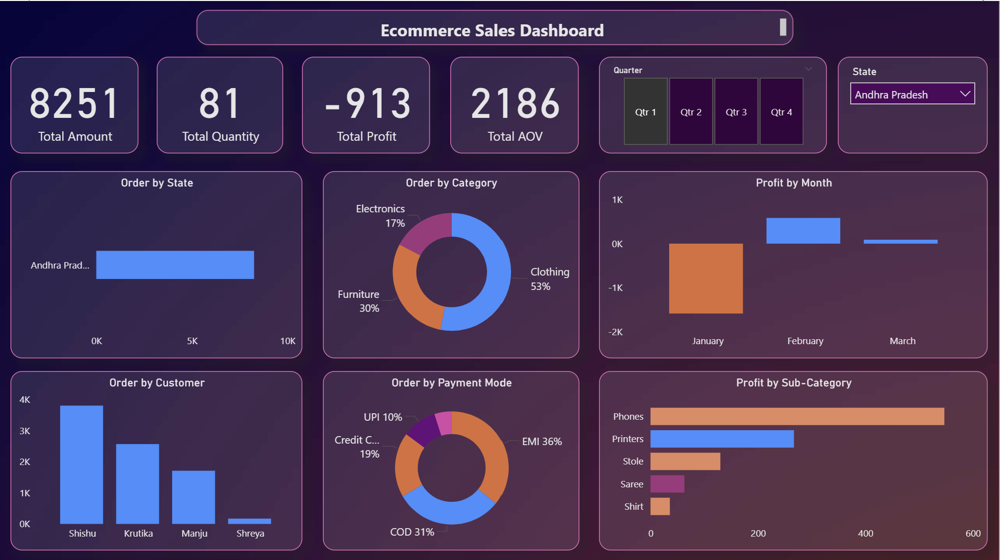
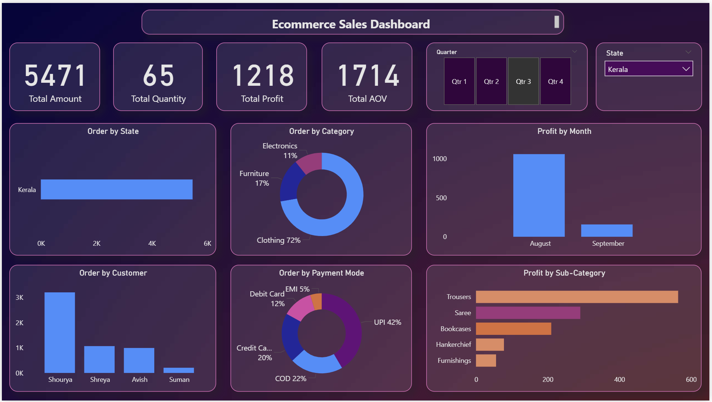

# 📊 Ecommerce Sales Dashboard (Power BI)

This repository contains a fully interactive **Ecommerce Sales Dashboard** built using Power BI. The report showcases key ecommerce metrics, regional performance, customer insights, and profit trends. It supports dynamic filtering by **State** and **Quarter**, allowing users to explore the data from multiple angles.

## 🚀 Key Features
- **Total Amount, Total Quantity, Total Profit, AOV** – dynamic KPIs
- **Order by State** – identifies top-performing regions
- **Order by Category** – Clothing, Electronics, Furniture, etc.
- **Profit by Month** – month-over-month comparison
- **Order by Customer** – top customers by spend
- **Order by Payment Mode** – COD, UPI, EMI, Credit/Debit Card
- **Profit by Sub-Category** – detailed breakdown like Saree, Phones, Bookcases, Trousers, etc.
- **Slicers for State and Quarter** – fully interactive filtering

## 🖼️ Dashboard Preview

  
  

## 🗂️ File Included
- **Ecommerce Sales Dashboard.pbix** – complete Power BI report with data model, measures, and visuals.

## 🛠️ Technologies Used
- Power BI Desktop  
- Power Query for data transformation  
- DAX for calculated measures  
- Star-schema style data modeling  

## 📦 How to Use
1. Download **Ecommerce Sales Dashboard.pbix**.  
2. Open it in Power BI Desktop (latest version recommended).  
3. Use the State and Quarter filters to explore insights dynamically.  
4. Refresh or connect your own dataset if needed.

## 📈 Ideal For
- Ecommerce performance tracking  
- Customer behavior and product profitability analysis  
- BI portfolios and analytics case studies  

## 🔮 Future Enhancements
- Add forecasting visuals  
- Integrate advanced segmentation using DAX  
- Publish to Power BI Service with scheduled refresh
